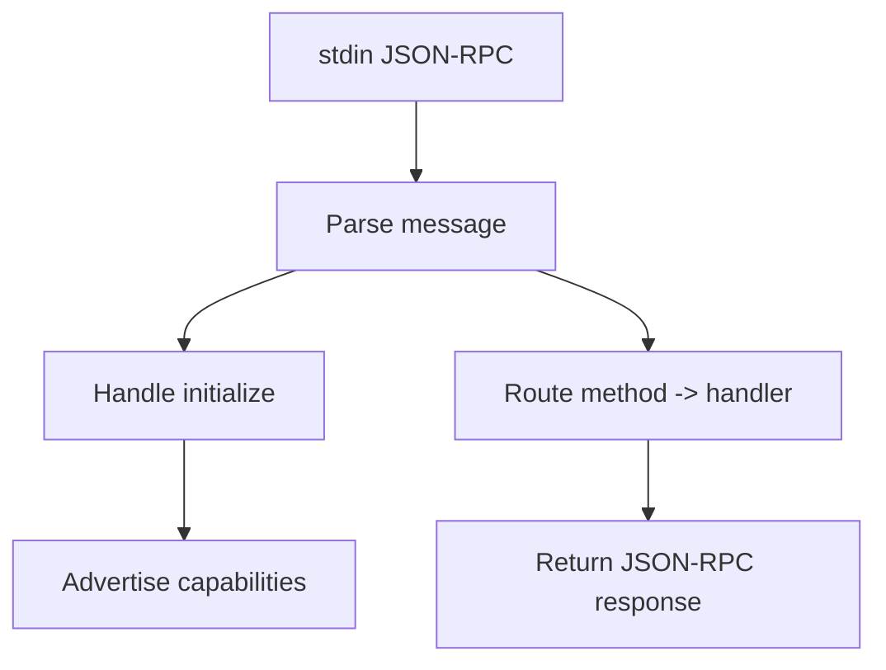

# Skeleton – MCP Local Memory Server Loop (Node.js)

## Purpose

Dokumen ini mendefinisikan server loop MCP JSON-RPC minimal untuk MCP Local Memory Server.

**Tujuan skeleton ini:**
- Menjadi *drop-in replacement* untuk MCP memory remote
- Fokus ke contract & flow, bukan storage
- Mudah dikembangkan ke SQLite + vector DB

> *Catatan: Skeleton ini sengaja boring & eksplisit. MCP server yang bagus itu stabil, bukan pintar.*

---

## High-Level Flow



---

## Required Files

```
mcp-memory-local/
├─ server.ts            # entrypoint (JSON-RPC loop)
├─ capabilities.ts      # static MCP contract
├─ router.ts            # method dispatcher
├─ tools/
│  ├─ memory.store.ts
│  ├─ memory.search.ts
│  └─ memory.summarize.ts
├─ resources/
│  ├─ list.ts
│  └─ read.ts
└─ prompts/
   └─ registry.ts
```

---

## `server.ts` (JSON-RPC Loop)

```typescript
import readline from "node:readline";
import { handleMethod } from "./router.js";
import { CAPABILITIES } from "./capabilities.js";

const rl = readline.createInterface({
  input: process.stdin,
  output: process.stdout,
  terminal: false
});

function reply(payload: unknown) {
  process.stdout.write(JSON.stringify(payload) + "\n");
}

rl.on("line", async (line) => {
  if (!line.trim()) return;

  let msg;
  try {
    msg = JSON.parse(line);
  } catch {
    return;
  }

  const { id, method, params } = msg;

  // --- initialize ---
  if (method === "initialize") {
    reply({
      jsonrpc: "2.0",
      id,
      result: {
        protocolVersion: "2024-11-05",
        serverInfo: CAPABILITIES.serverInfo,
        capabilities: CAPABILITIES.capabilities
      }
    });

    reply({
      jsonrpc: "2.0",
      method: "notifications/initialized",
      params: {}
    });
    return;
  }

  // --- ignore notification ---
  if (method === "notifications/initialized") return;

  // --- route method ---
  try {
    const result = await handleMethod(method, params);

    reply({
      jsonrpc: "2.0",
      id,
      result
    });
  } catch (err: any) {
    reply({
      jsonrpc: "2.0",
      id,
      error: {
        code: -32603,
        message: err.message || "Internal error"
      }
    });
  }
});
```

---

## `capabilities.ts`

```typescript
export const CAPABILITIES = {
  serverInfo: {
    name: "mcp-memory-local",
    version: "0.1.0"
  },
  capabilities: {
    resources: {
      list: true,
      read: true,
      templates: true
    },
    tools: {
      list: true,
      call: true
    },
    prompts: {
      list: true,
      get: true
    }
  }
};
```

---

## `router.ts` (Method Dispatcher)

```typescript
import { listResources, readResource } from "./resources/index.js";
import { PROMPTS } from "./prompts/registry.js";

export async function handleMethod(method: string, params: any) {
  switch (method) {
    // ---- tools ----
    case "tools/list":
      return { tools: [] };

    case "tools/call":
      return { result: "not implemented" };

    // ---- resources ----
    case "resources/list":
      return listResources();

    case "resources/read":
      return readResource(params?.uri);

    // ---- prompts ----
    case "prompts/list":
      return { prompts: Object.values(PROMPTS) };

    case "prompts/get":
      return { prompt: PROMPTS[params.name] };

    default:
      throw new Error(`Unsupported method: ${method}`);
  }
}
```

---

## `prompts/registry.ts`

```typescript
export const PROMPTS = {
  "memory-agent-core": {
    name: "memory-agent-core",
    description: "Core behavioral contract for memory-aware agents",
    content: `You are a coding copilot agent.

Respect stored decisions.
Avoid repeating mistakes.
Memory is a source of truth.`
  }
};
```

---

## `resources/index.ts`

```typescript
export function listResources() {
  return {
    resources: [
      { uri: "memory://index", title: "Memory Index" }
    ]
  };
}

export function readResource(uri: string) {
  return {
    resource: {
      uri,
      title: "Not implemented",
      content: ""
    }
  };
}
```

---

## Why This Skeleton Works

- Matches MCP lifecycle exactly
- Easy to extend per tool
- No storage coupling
- Agent-safe (no breaking contract)

*Ini adalah fondasi yang tepat sebelum:*
1. SQLite
2. Vector search
3. Auto-memory logic

---

## Next Recommended Step

1. Tambah tool definitions (`memory.store`, `memory.search`)
2. Tambah git-scope resolver
3. Baru wiring ke SQLite

*Kalau kamu mau, langkah berikutnya aku bisa:*
- Tambahkan tool schema lengkap
- Tambahkan git scope resolver code
- Tambahkan SQLite + vector stub
