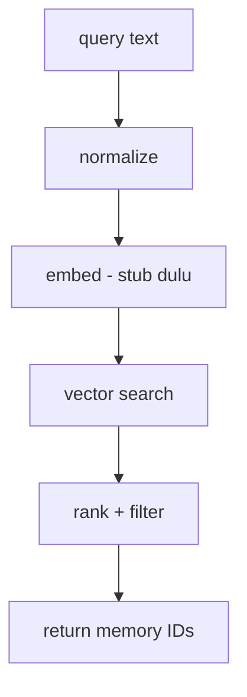

# Spec – Vector Search Stub & Similarity Layer

## Purpose

Dokumen ini mendefinisikan vector search layer (stub) untuk MCP Local Memory Server.

**Fokus dokumen ini:**
- Menyediakan abstraction yang benar sebelum embedding/model dipilih
- Mendukung typo, paraphrase, dan semantic similarity
- Aman untuk diintegrasikan dengan SQLite schema yang sudah ada

> *Prinsip: jangan nikahi embedding atau library terlalu cepat.*

---

## Design Goals

1. **Replaceable** – embedding & index bisa diganti
2. **Predictable** – ranking stabil
3. **Repo-scoped** – tidak ada cross-project similarity
4. **Fail-safe** – jika vector gagal, agent tetap jalan

---

## Conceptual Model



*Vector layer tidak pernah return full memory.*

---

## Vector Responsibility Boundary

**Vector Layer BOLEH:**
- Hitung similarity
- Return memory_id + score

**Vector Layer TIDAK BOLEH:**
- Filter by repo (harus sudah dilakukan)
- Filter by type / importance
- Mengubah atau menulis data

---

## Vector Interface (Canonical)

```typescript
export type VectorResult = {
  id: string;
  score: number;   // 0.0 – 1.0
};

export interface VectorStore {
  upsert(id: string, text: string): Promise<void>;
  remove(id: string): Promise<void>;
  search(query: string, limit: number): Promise<VectorResult[]>;
}
```

*Ini kontrak WAJIB dijaga.*

---

## Stub Implementation (No Embedding Yet)

`storage/vectors.stub.ts`

```typescript
import { VectorStore, VectorResult } from "./types.js";

export class StubVectorStore implements VectorStore {
  async upsert(id: string, text: string) {
    // no-op
  }

  async remove(id: string) {
    // no-op
  }

  async search(query: string, limit: number): Promise<VectorResult[]> {
    return [];
  }
}
```

**Dengan stub ini:**
- MCP server jalan
- Tool contract stabil
- Vector bisa ditambahkan belakangan

---

## Normalization Layer (WAJIB)

Normalization dilakukan sebelum embedding.

```typescript
export function normalize(text: string): string {
  return text
    .toLowerCase()
    .replace(/[^a-z0-9\s]/g, " ")
    .replace(/\s+/g, " ")
    .trim();
}
```

*Normalization ini sudah membantu typo ringan, bahkan tanpa vector.*

---

## Ranking Strategy (Server-side)

Vector similarity **BUKAN** satu-satunya sinyal.

**Final score =**
```
(similarity * 0.7)
+ (importanceBoost * 0.2)
+ (recencyBoost * 0.1)
```

**Dimana:**
- `importanceBoost` = `importance / 5`
- `recencyBoost` = decay berdasarkan `created_at`

> *Ini bikin agent terasa stabil & dewasa.*

---

## `memory.search` Integration Flow

```typescript
// 1. fetch candidates by repo + importance
// 2. vector.search(query)
// 3. merge scores
// 4. threshold + limit
```

*Jika vector kosong → fallback ke keyword match.*

---

## Fallback Strategy (WAJIB)

**Jika:**
- embedding service down
- vector index corrupt

**Maka:**
- Gunakan `LIKE %query%` di SQLite
- Tetap hormati repo boundary

*Agent tidak boleh error karena vector.*

---

## Future Implementations (Drop-in)

VectorStore bisa diganti dengan:
- sqlite-vec
- sqlite-vss
- hnswlib-node
- faiss (via binding)

**Tanpa mengubah:**
- tool schema
- MCP contract
- agent prompt

---

## Anti-Patterns (DILARANG)

- ❌ Store vector tanpa text canonical
- ❌ Vector sebagai source of truth
- ❌ Global vector index lintas repo
- ❌ Tuning threshold tanpa test

---

## Final Take

Vector layer adalah **amplifier**, bukan otak.

**Kalau stub + boundary ini dijaga:**
- Kamu bisa eksperimen bebas
- Agent tetap stabil
- Produk tidak terkunci vendor

Ini langkah terakhir sebelum implementasi embedding nyata.
